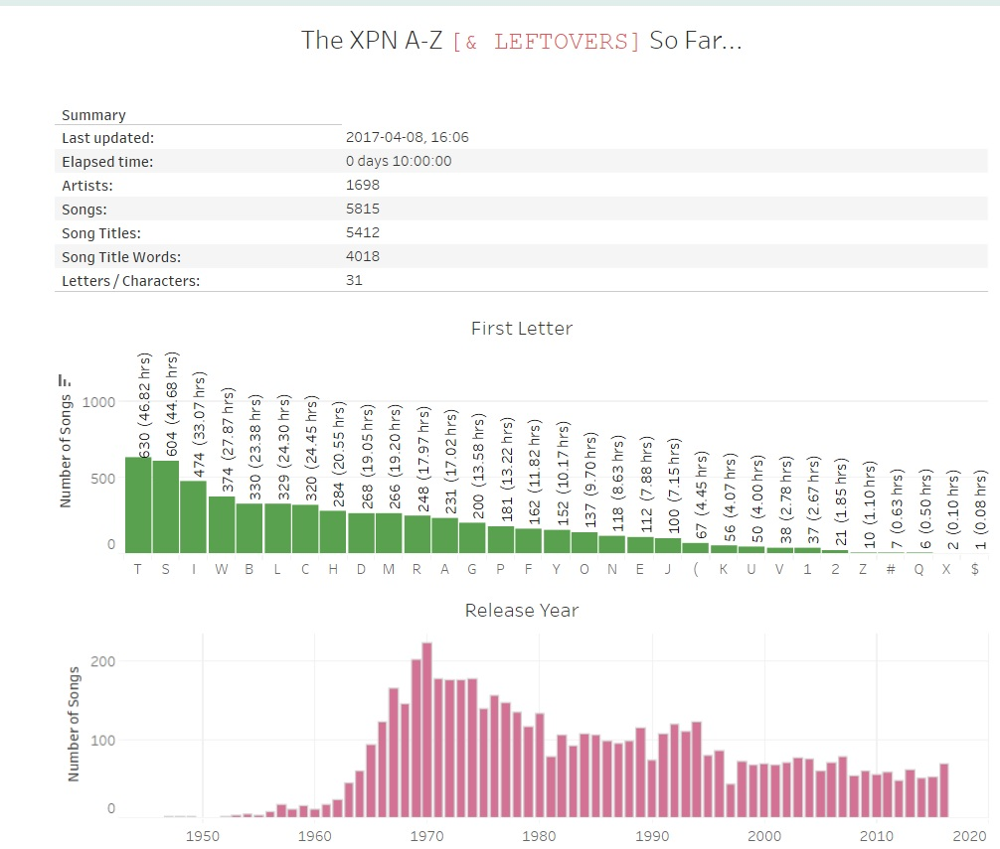

# XPN A to Z Analysis
by Lena R. Bartell (twitter: @lenabartell)

## Summary

In a massive marathon event, WXPN radio in Philadelphia played over 5,000 songs from their library in alphabetical order. The marathon started on November 30 and continued 24/7 until mid-day on December 17, 2016. To learn more, check out their website: [WXPN radio](http://xpn.org/music-artist/xpn-a-z) (on twitter @wxpnfm, #XPNAtoZ). During the marathon, I developed this code to analyze the playlist. 

Here's a quick analysis, including code to
1. Scrape data from the xpn.org playlist website using scrapy spider (`scrape_playlist\scrape_playlist\spiders\xpnplaylist_spider.py`)
2. Use the MusicBrainz.org online database & API to collect more song metadata (`wordplay.py`)
3. Analyze and export the results (`wordplay.py`)

## In the news

1. ["Meet Lena Bartell, #XPNAtoZ data nerd and massive music fan"](http://thekey.xpn.org/2016/12/16/lena-bartell/), by Bruce Warren. December 16, 2016.
2. ["Tuning in to the WXPN A to Z marathon, alphabetically"](http://www.philly.com/philly/blogs/inthemix/Tuning-in-alphabetically-to-the-XPN-A-to-Z.html), by Dan DeLuca. December 16, 2016.
3. ["BEHOLD, DATA NERDS, THIS INSANE BREAKDOWN OF WXPN'S #XPNATOZ COUNTDOWN"](http://www.philebrity.com/blog/2016/12/16/behold-data-nerds-this-is-insane-breakdown-of-wxpns-xpnatoz-countdown), on philebrity.com. December 16, 2016.

## Tableau interactive viz 

## Related Work

Also check out complementary analysis of the playlist by [Drew Sudell](https://github.com/asudell/a2z) and [Bruce Segal](https://twitter.com/besegal)